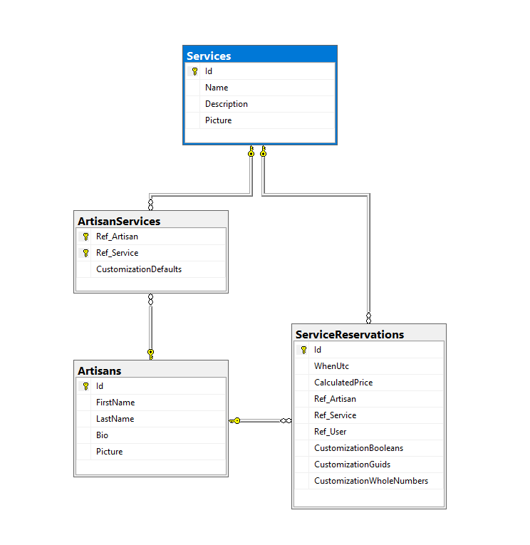

# FixMyHouse - Описание на базата от данни



### Artisans - Таблица с Майстори

`Name`, `Bio` - име, кратко описание

`Picture` - име на файла със снимка на майстора

### Services - Таблица с видове услуги

`Name`, `Description` - име, кратко описание на услуга

`Picture` - има на файла с илюстрация на услуга

### ArtisanServices - Бридж таблица между майстори и видове услуги

`CustomizationDefaults`e JSON колона, която описва полетата за персонализиране на услугата и има подобна схема:

`({id, name, description} & ({ type: "checkbox", valueIfTrue: decimal } | {type: "whole-number" & valueMultiplier: decimal } | { type: "options", availableOptions: [...] }))[]`

Т.е, това е сериализиран масив от "discriminated union" тип, като има различен вариант за всеки тип поле.

Пример:

```json
[
    {
        "$type": "checkbox",
        "ValueIfTrue": 100,                                 //Ако кутийката е маркирана, ще прибавим това към цената
        "Value": false,                                     //Стойност по подразбиране 
        "Id": "525e7b61-27d7-4995-9338-9119b54b63b5",       //ID на полето
        "Name": "Екстра дюбели",
        "Description": "+2 години гаранция"
    },
    {
        "$type": "whole-number",
        "ValueMultiplier": 300,                             //Умножаваме това по въведената стойност и го прибавяме към цената
        "Value": 1,                                         //Стойност по подразбиране
        "Id": "7d666de3-5f4f-4110-883d-100fe2ea4c2c",       //ID на полето
        "Name": "Брой помещения",
        "Description": "+300лв / помещение"
    },
    {
        "$type": "options",
        "AvailableOptions": [
            { "Id": "13f5e1d4-38d7-4189-84c7-a11765e3eac2", "Name": "Мокет", "Price": 100 },
            { "Id": "e7671bf6-061e-4bb5-bd85-65caf770936f", "Name": "Ламинат", "Price": 150 },
            { "Id": "dbd2051b-8753-4454-9eee-f5655093b111", "Name": "Паркет", "Price": 300 },
            { "Id": "cb010910-0c31-412e-a32a-5d10f026cbb9", "Name": "Балатум", "Price": 75 }
        ],
        "Value": "13f5e1d4-38d7-4189-84c7-a11765e3eac2",     //ID на избраната стойност (в случая, "Мокет")
        "Id": "130820ee-1ec2-418f-b113-8485bc168d29",        //ID на полето
        "Name": "Вид настилка",
        "Description": "Изберете как да излежда вашият под"
    }
]
```


### ServiceReservations - Таблица с резервирани услуги

`CustomizationBooleans` е JSON колона със сериализиран `Dictionary<Guid, bool>` за всички стойности `bool` полета на съответната услуга. Ключът на речника е Id-то на съответното поле.

`CustomizationGuids` е JSON колона със сериализиран `Dictionary<Guid, Guid>` за всички `Guid` полета на съответната услуга - това са dropdown полетата, т.к всяка опция от един dropdown има id. Ключът на речника е Id-то на съответното поле.

`CustomizationWholeNumbers` е JSON колона със сериализиран `Dictionary<Guid, int>` за всички целочислени полета на съответната услуга. Ключът на речника е Id-то на съответното поле.

`CalculatedPrice` е обикновена `decimal` колона и се изчислява от приложението по време на резервиране на услугата.

### Други бележки

**Има доста други таблици от ASP.Net Core Identity, но те са стандартни.**